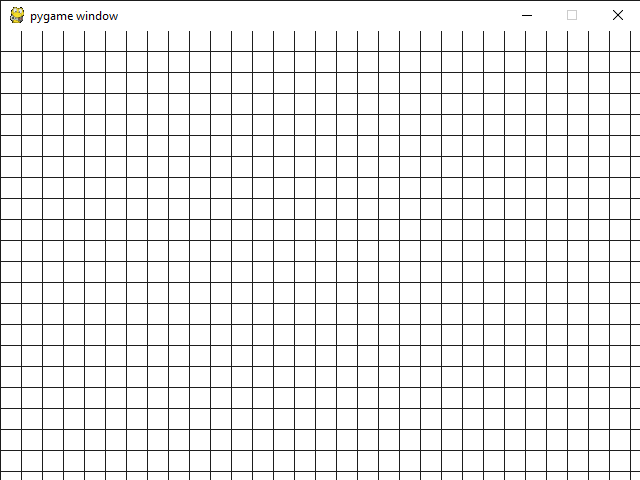
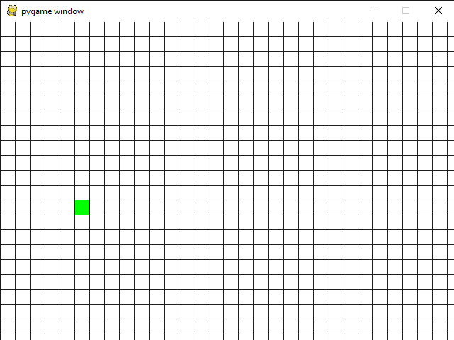
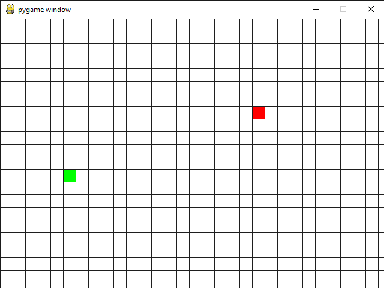
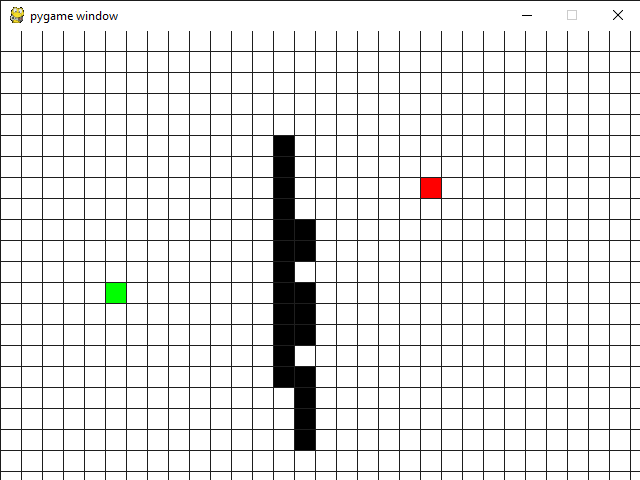
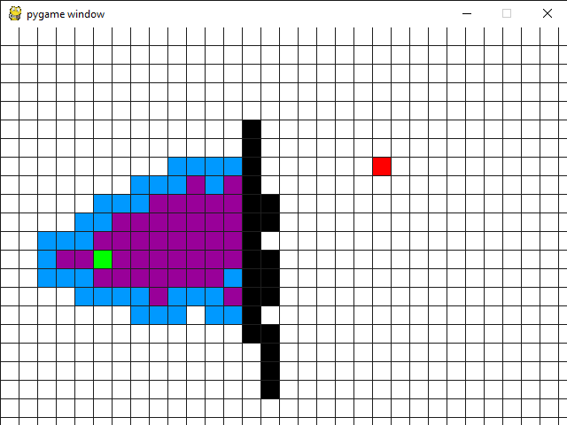
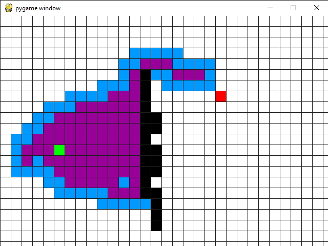
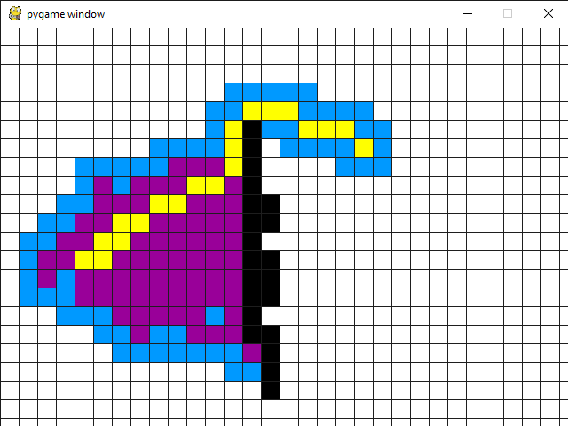

# A* Search algorithm

## About the project


I builded a visualization of A* algorithm with pygame

#### How to install

* Download the repositories in pc
* Create an env
* Install requirements.txt
```python
pipenv install -r requirements.txt
```

#### How to use

When start, window will lock like this:



To select a starting point you need to click with left click  on one of rectangles



For end point the same as at the start



If you want to put wall between point, after you select start and end, with  left click select rectangles 





To start algorithm press space 







After he stopped if you want to clear window press space


A gif with algorithm in action

